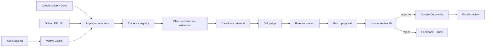
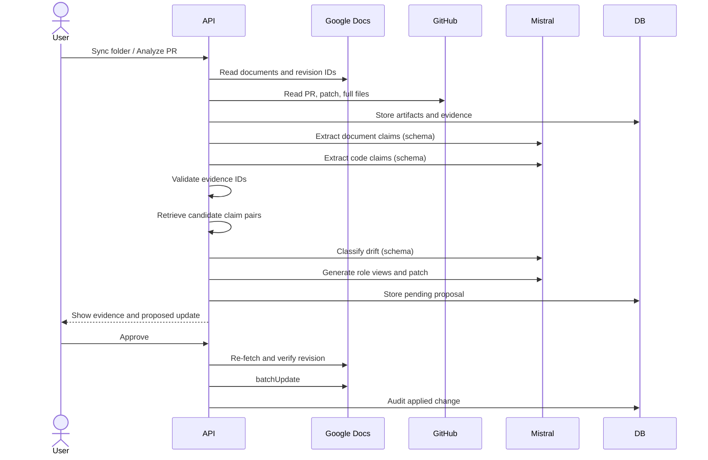

# System architecture

## Architecture diagram

## Components

### Frontend

Next.js application containing:

- source setup;
- sync/analyze controls;
- drift inbox;
- alert review;
- product/developer toggle;
- evidence drawer;
- patch diff;
- decision log;
- approval actions.

### Backend

FastAPI application containing:

- integration adapters;
- source normalization;
- evidence registry;
- Mistral gateway;
- retrieval and drift pipeline;
- write safety;
- audit store.

### Persistence

Use SQLite for the hackathon. Keep repository interfaces so PostgreSQL can replace it later.

Persist:

- source metadata and hashes;
- evidence spans;
- claims;
- claim relationships;
- decisions;
- alerts;
- proposals;
- approvals;
- audit events.

Raw audio and large artifacts can stay on local disk for the demo.

## Core pipeline

## Why not one agent

The application uses separate calls because each stage has a different failure mode and test:

- extraction accuracy;
- retrieval recall;
- contradiction precision;
- role translation quality;
- patch grounding.

This is more trustworthy and technically defensible than one autonomous prompt with broad tools.

## Optional Mistral Workflows path

Mistral Workflows can later orchestrate the same stages durably. External I/O and model calls should be activities; workflow code must remain deterministic and activities must be retry-safe. This is an enhancement, not a blocker for the first demo.
