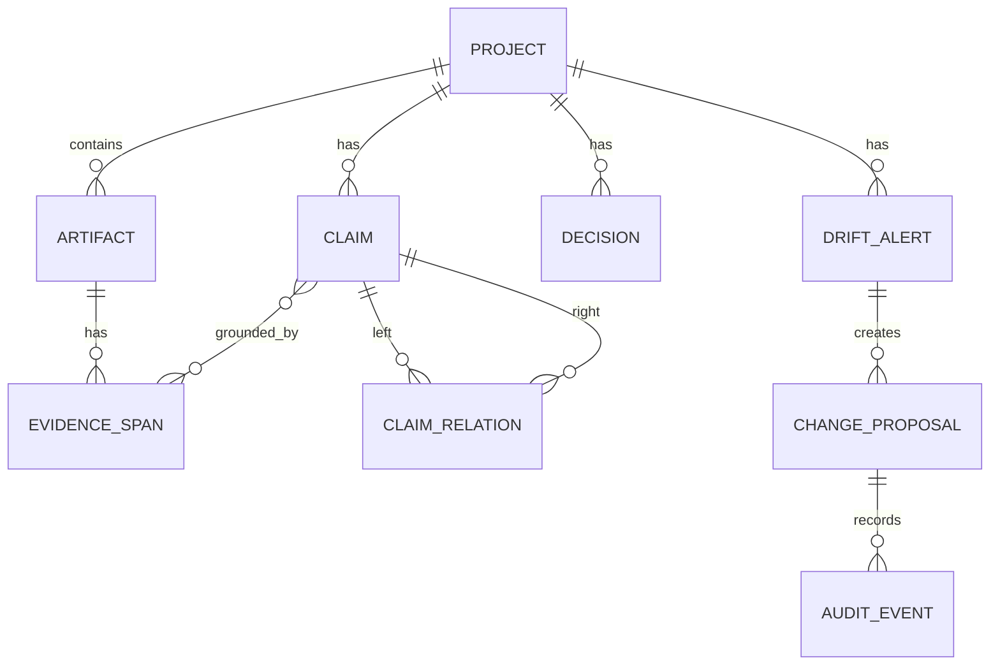

# Data model

## Conceptual model

## Core records

### Artifact

- source type
- external ID
- URI
- title
- version or commit SHA
- content hash
- observed time
- raw normalized content

### EvidenceSpan

- stable ID
- artifact ID
- locator type
- start/end locator
- exact excerpt
- hash

### Claim

- subject
- predicate
- object/statement
- claim type
- scope
- status
- confidence
- effective dates
- evidence IDs

### Decision

- statement
- status
- owner
- approvers
- alternatives
- conditions
- timestamp evidence

### DriftAlert

- relationship
- severity
- confidence
- concise reason
- conflicting claim IDs
- missing evidence
- recommended reviewers
- status

### ChangeProposal

- target document
- expected revision
- patch operations
- PM explanation
- developer explanation
- approval status

### AuditEvent

- actor
- action
- object
- timestamp
- evidence/model/prompt metadata

## SQLite schema

See `schemas/db.sql`.

## Pydantic schemas

See `apps/api/app/domain/schemas.py`.
